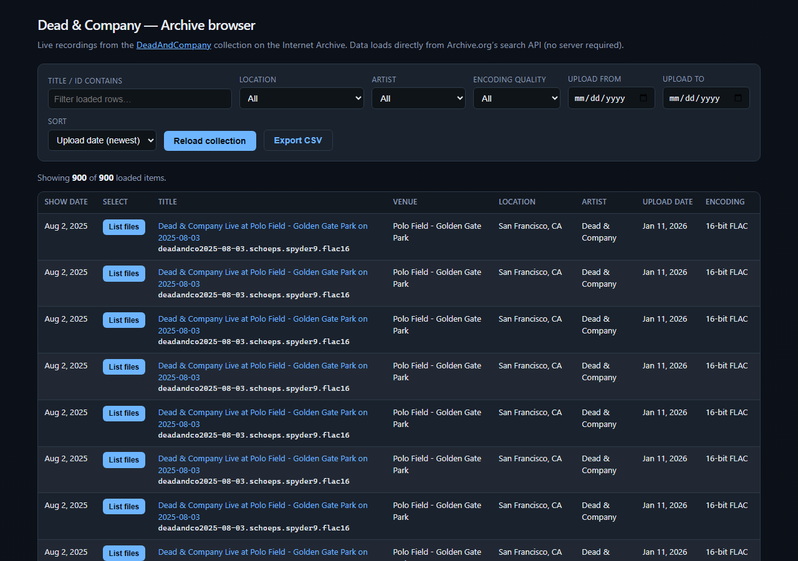

# archive_music — Dead & Company Internet Archive browser

A small, dependency-free web page that lists and filters live recordings from the [DeadAndCompany](https://archive.org/details/DeadAndCompany) collection on the Internet Archive. Everything runs in the browser; there is no backend.



## Contents

| File | Description |
|------|-------------|
| `dead-and-company-browser.html` | Single HTML file (markup, styles, and script). Open in a modern browser or serve locally. |
| `dead-and-company-browser.png` | Screenshot of the main UI (filters and table). |

## Quick start

1. Open `dead-and-company-browser.html` in **Google Chrome** (or another current browser).
2. The page loads collection data from Archive.org automatically (paginated API requests).
3. Use the filters and sort options, then use **Export CSV** if you want a spreadsheet of the **currently visible** table rows.

If opening the file via `file://` causes network or CORS issues in your environment, serve the project directory over HTTP and open the page from `http://localhost`, for example:

```bash
npx --yes serve .
```

## What the app shows

### Main table

- **Show date** — Concert date from item metadata (`date`).
- **Title** — Links to the item on archive.org; the internal identifier is shown below the title.
- **Select** — **List files** opens an expandable section for that show (see below).
- **Venue** / **Location** — From `venue` and `coverage` (city/region) when the Archive has them.
- **Artist** — From `creator` (typically “Dead & Company”).
- **Upload date** — From `publicdate` or `addeddate`.
- **Encoding** — A coarse label inferred from the search index’s `format` field and the item `identifier` (for example 16-bit vs 24-bit FLAC, MP3 VBR). It reflects how the item is described in the index, not a full per-file technical audit.

### Per-show file list (inline expansion)

Click **List files** on a row to insert an **expandable block directly under that concert** in the table. The page fetches full item metadata and lists playable audio files with links to each file’s download URL (`https://archive.org/download/{identifier}/{filename}`).

- **Play full concert in Webamp** — Opens the Archive **details** page with Webamp enabled:  
  `https://archive.org/details/{identifier}?webamp=default`  
  (Archive’s built-in Webamp experience for that item.)
- **Open item page on Archive.org** — Standard item details URL.
- **Close** (or **List files** again on the same row) collapses the expansion.

## Data sources

**Collection listing** — Archive.org **Advanced Search** API:

- Query: `collection:DeadAndCompany`
- Fields include: `identifier`, `title`, `creator`, `date`, `venue`, `coverage`, `publicdate`, `addeddate`, `format`

**Per-item files** — After you expand a row, the page calls the **Metadata** API:

- `https://archive.org/metadata/{identifier}`  
  Audio files are filtered from the `files` array (FLAC, MP3, Ogg, etc.; fingerprints, artwork, and other non-audio entries are skipped).

The collection size and metadata can change over time as items are added or updated on the Archive.

## Limitations

- Requires network access to `https://archive.org`.
- Encoding labels in the main table are heuristics; for authoritative technical detail, open the item on the Archive and inspect files and descriptions.
- Some rows may have missing venue or location if upstream metadata is incomplete.

## License

The HTML/CSS/JS in this repository is provided as-is for personal use. Recordings on the Internet Archive remain subject to their respective licenses and Archive.org terms.
